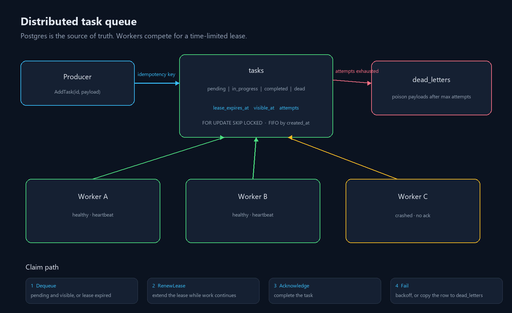
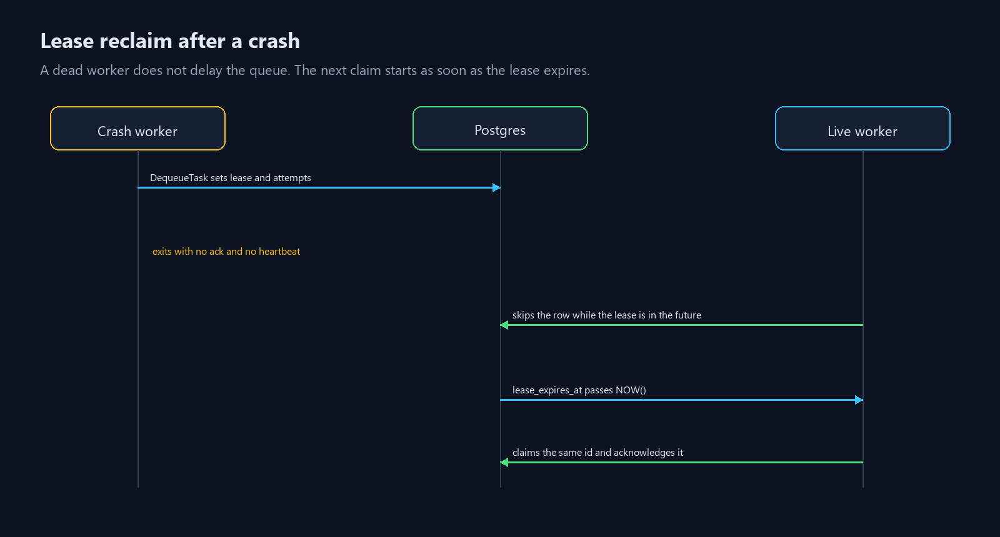
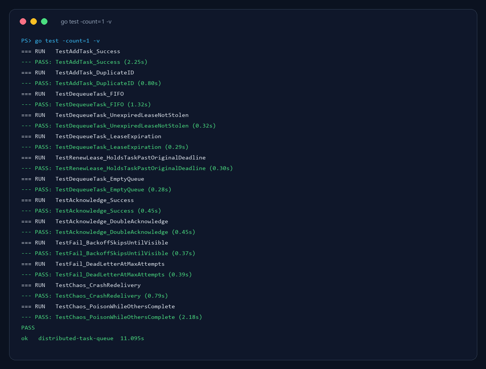
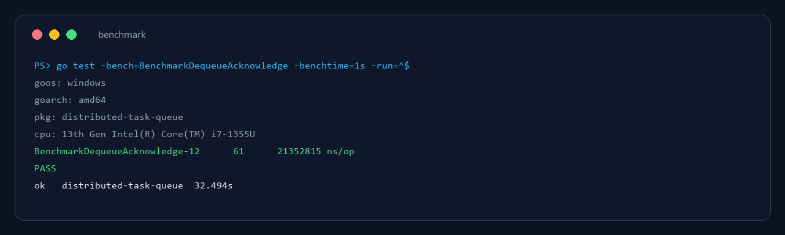
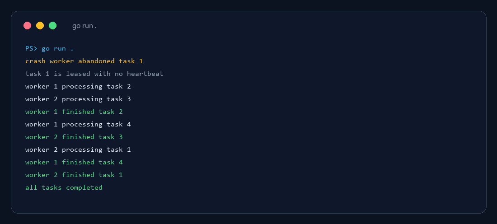

# Distributed Task Queue


A small durable queue. Producers insert a task once. Any number of workers compete to claim it. A claim is a lease, not a permanent lock, so a worker that dies does not take the task with it.

```bash
docker compose up -d
go test -count=1 -v
go run .
```

Postgres listens on `localhost:5444` (`taskqueue` / `taskqueue`, database `taskqueue`).

## What it guarantees

Delivery is at least once. A crash after the work and before `Acknowledge` runs the handler again. The caller-supplied id is the idempotency key, so a retried `AddTask` returns the original row and does not change the payload. Consumers should treat that id as their own dedupe key.

A row can be claimed when:

- it is `pending` and `visible_at` has passed, or
- it is `in_progress` and `lease_expires_at` is already in the past

`DequeueTask` locks one row with `FOR UPDATE SKIP LOCKED`, ordered by `created_at`. Two workers cannot claim the same row. FIFO applies to rows that are visible now. A task waiting out its backoff can let a newer pending task run first, so one failure does not block the queue.

## Architecture



The database is the queue. Workers do not talk to each other. They race on the claim query, renew the lease while they are healthy, then either acknowledge the task or fail it.



A crashed worker is reclaimed as soon as the lease expires. `Fail` is the path that waits: `1s`, `2s`, `4s`, and so on, capped at `30s`. At `max_attempts` (default 5) the row is marked `dead` and copied into `dead_letters`. Each claim counts as one attempt, including a claim that ends in a crash.

## Project layout

| Path | Role |
| --- | --- |
| `queue.go` | Add, dequeue, renew, acknowledge, fail |
| `worker.go` | Claim loop, heartbeat, acknowledge |
| `main.go` | Crash demo, and `go run . worker` |
| `db.go` | Connection and schema |
| `queue_test.go` | FIFO, leases, backoff, dead letters, chaos |
| `queue_bench_test.go` | Claim plus ack benchmark |
| `docker-compose.yml` | Postgres 16 on port 5444 |

## API

| Method | Effect |
| --- | --- |
| `AddTask(id, payload)` | Insert `pending`, or return the row that already uses this id |
| `DequeueTask()` | Claim the oldest visible row and start a lease |
| `RenewLease(id)` | Push `lease_expires_at` forward while the row is `in_progress` |
| `Acknowledge(id)` | Mark the row `completed` |
| `Fail(id, reason)` | Back off, or dead-letter once attempts are exhausted |

`NewQueue` uses a 30 second lease and 5 attempts. The demo shortens the lease to 2 seconds so a crash is visible in one run.

## Run a worker process

`go run .` clears the tables, enqueues four tasks, abandons one without a heartbeat, and runs two workers until every task is completed.

```bash
go run . worker 1
go run . worker 2
```

Each command is one OS process. Tests use goroutines instead, against the same SQL.

```bash
make test
make bench
make demo
```

## Tests

The suite talks to the compose Postgres. An in-memory fake would hide the locks and the lease clock these tests exist to catch.



`TestChaos_CrashRedelivery` claims a task, drops the lease into the past, and checks that another goroutine acknowledges that same id after running it again. `TestChaos_PoisonWhileOthersComplete` fails one payload until it lands in `dead_letters` while the other tasks still complete.

## Benchmark

`BenchmarkDequeueAcknowledge` seeds a batch, then times claim plus ack. This is an integration benchmark against local Postgres, not a CPU microbenchmark.



On the machine used for this run, claim plus ack took about 21.4ms per operation (61 iterations in a 1 second window).

## Crash demo



Worker 2 picked up task 1 only after the crash worker had already abandoned it. The other three tasks were finished by the healthy workers and were not stolen, because those workers renewed their leases.
